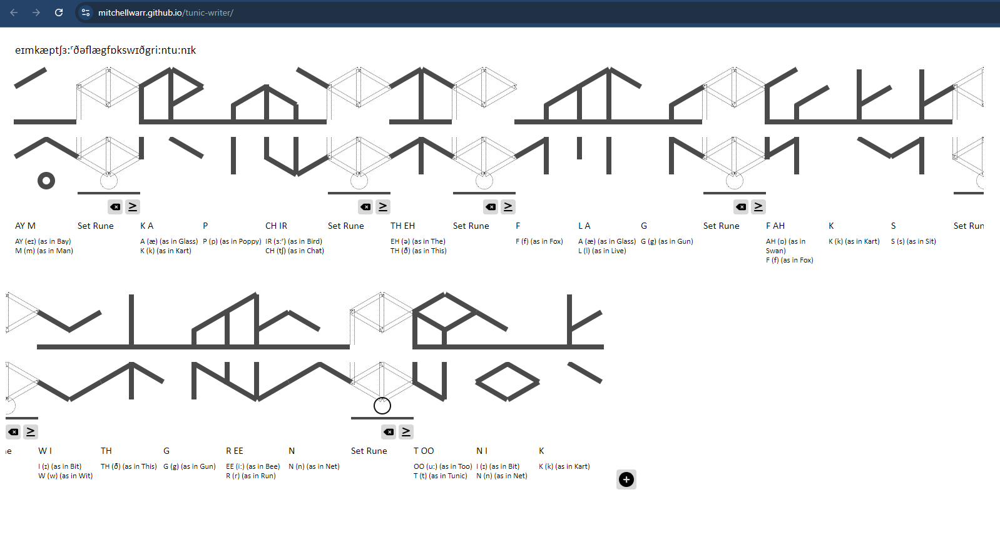

# SeekerOfRuin
> Hey You! Can you find out what this means? The flag is a bit wierd, regex is helping you. Type what you find.
> 
> 

## Solution
Reverse image search SeekerOfRuin.png to identify the glyphs as Tunic glyphs from the game "Tunic".

Use a tool like https://mitchellwarr.github.io/tunic-writer/ to decode the glyphs.

They will decode to "eɪmkæptʃɜ:ʳðəflægfɒkswɪðgri:ntu:nɪk" or "AY M K A P CH IR TH EH  F LA G F O K S W I TH G R I N T U N I K".

eɪm = Sikt
kæptʃɜ:ʳðəflæg = CTF
fɒkswɪðgri:ntu:nɪk = {fox with green tunic}

The flag is SiktCTF{fox with green tunic}

> Flag: SiktCTF{fox with green tunic}