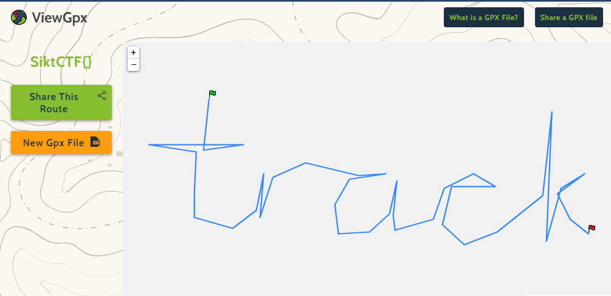

# sloth

> Some files were stored on an old usb-stick, but this was unforunately formatted. If there just was some way to find and retrieve these files, it could be possible to find a flag...
> Assets: disk.raw.

## Solution

```bash
oyvind@NTNU19560:~/tmp$ sudo testdisk disk.raw
```

```
TestDisk 7.1, Data Recovery Utility, July 2019
Christophe GRENIER <grenier@cgsecurity.org>
https://www.cgsecurity.org

  TestDisk is free software, and
comes with ABSOLUTELY NO WARRANTY.

Select a media (use Arrow keys, then press Enter):
>Disk disk.raw - 104 MB / 100 MiB


>[Proceed ]  [  Quit  ]

Note: Disk capacity must be correctly detected for a successful recovery.
If a disk listed above has an incorrect size, check HD jumper settings and BIOS
detection, and install the latest OS patches and disk drivers.
```

Press enter to proceed.

```
TestDisk 7.1, Data Recovery Utility, July 2019
Christophe GRENIER <grenier@cgsecurity.org>
https://www.cgsecurity.org


Disk disk.raw - 104 MB / 100 MiB

Please select the partition table type, press Enter when done.
>[Intel  ] Intel/PC partition
 [EFI GPT] EFI GPT partition map (Mac i386, some x86_64...)
 [Humax  ] Humax partition table
 [Mac    ] Apple partition map (legacy)
 [None   ] Non partitioned media
 [Sun    ] Sun Solaris partition
 [XBox   ] XBox partition
 [Return ] Return to disk selection


Hint: Intel partition table type has been detected.
Note: Do NOT select 'None' for media with only a single partition. It's very
rare for a disk to be 'Non-partitioned'.
```

Press enter to select "Intel".

```
TestDisk 7.1, Data Recovery Utility, July 2019
Christophe GRENIER <grenier@cgsecurity.org>
https://www.cgsecurity.org


Disk disk.raw - 104 MB / 100 MiB
     CHS 13 255 63 - sector size=512

>[ Analyse  ] Analyse current partition structure and search for lost partitions
 [ Advanced ] Filesystem Utils
 [ Geometry ] Change disk geometry
 [ Options  ] Modify options
 [ MBR Code ] Write TestDisk MBR code to first sector
 [ Delete   ] Delete all data in the partition table
 [ Quit     ] Return to disk selection


Note: Correct disk geometry is required for a successful recovery. 'Analyse'
process may give some warnings if it thinks the logical geometry is mismatched.
```

Press Enter to Analyse.

```
TestDisk 7.1, Data Recovery Utility, July 2019
Christophe GRENIER <grenier@cgsecurity.org>
https://www.cgsecurity.org

Disk disk.raw - 104 MB / 100 MiB - CHS 13 255 63
Current partition structure:
     Partition                  Start        End    Size in sectors

Warning: number of heads/cylinder mismatches 0 (NTFS) != 255 (HD)
Warning: number of sectors per track mismatches 0 (NTFS) != 63 (HD)
 1 P HPFS - NTFS              0  32 33    12 190 50     202752 [ext3]
No partition is bootable


*=Primary bootable  P=Primary  L=Logical  E=Extended  D=Deleted
>[Quick Search]  [ Backup ]
                            Try to locate partition
```

Press Enter to Quick Search.

```
TestDisk 7.1, Data Recovery Utility, July 2019
Christophe GRENIER <grenier@cgsecurity.org>
https://www.cgsecurity.org

Disk disk.raw - 104 MB / 100 MiB - CHS 13 255 63
     Partition               Start        End    Size in sectors
>* HPFS - NTFS              0  32 33    12 190 50     202752 [ext3]


Structure: Ok.  Use Up/Down Arrow keys to select partition.
Use Left/Right Arrow keys to CHANGE partition characteristics:
*=Primary bootable  P=Primary  L=Logical  E=Extended  D=Deleted
Keys A: add partition, L: load backup, T: change type, P: list files,
     Enter: to continue
NTFS, blocksize=4096, 103 MB / 99 MiB
```

The analyze found a NTFS partition... Press Enter to continue.

```
TestDisk 7.1, Data Recovery Utility, July 2019
Christophe GRENIER <grenier@cgsecurity.org>
https://www.cgsecurity.org

Disk disk.raw - 104 MB / 100 MiB - CHS 13 255 63

     Partition                  Start        End    Size in sectors

 1 * HPFS - NTFS              0  32 33    12 190 50     202752 [ext3]


 [  Quit  ]  [ Return ] >[Deeper Search]  [ Write  ]
                          Try to find more partitions
```

Choose "Deeper Search" and press Enter.

```
TestDisk 7.1, Data Recovery Utility, July 2019
Christophe GRENIER <grenier@cgsecurity.org>
https://www.cgsecurity.org

Disk disk.raw - 104 MB / 100 MiB - CHS 13 255 63
     Partition               Start        End    Size in sectors
 D HPFS - NTFS              0  32 33    12 190 50     202752 [ext3]
>D Linux                    4 247 52     7 132 61      40960


Structure: Ok.  Use Up/Down Arrow keys to select partition.
Use Left/Right Arrow keys to CHANGE partition characteristics:
*=Primary bootable  P=Primary  L=Logical  E=Extended  D=Deleted
Keys A: add partition, L: load backup, T: change type, P: list files,
     Enter: to continue
ext3 blocksize=4096 Large_file Sparse_SB, 20 MB / 20 MiB
```

A Linux partition was found. Press "P" to list files.


```
TestDisk 7.1, Data Recovery Utility, July 2019
Christophe GRENIER <grenier@cgsecurity.org>
https://www.cgsecurity.org
     Linux                    4 247 52     7 132 61      40960
Directory /

>drwxr-xr-x     0     0      4096 14-Aug-2024 10:53 .
 drwxr-xr-x     0     0      4096 14-Aug-2024 10:53 ..
 drwx------     0     0     16384 14-Aug-2024 10:18 lost+found
 -rw-r--r--     0     0    264570 14-Aug-2024 10:53 2aa
 -rw-r--r--     0     0    265545 14-Aug-2024 10:53 2ab
 -rw-r--r--     0     0    287829 14-Aug-2024 10:53 2ac
 -rw-r--r--     0     0     53844 14-Aug-2024 10:53 2ad


                                                   Next
Use Right to change directory, h to hide deleted files
    q to quit, : to select the current file, a to select all files
    C to copy the selected files, c to copy the current file
```

Press a to select all files and then 'C' (capital C) to copy the files to a directory.

Press 'q' four times to quit.

```bash	
oyvind@NTNU19560:~/tmp/restore$ ls -la
total 872
drwxr-xr-x 3 oyvind oyvind   4096 Oct 22 09:59 .
drwxr-xr-x 7 oyvind oyvind   4096 Oct 22 09:57 ..
-rw-r--r-- 1 root   root   264570 Aug 14 10:53 2aa
-rw-r--r-- 1 root   root   265545 Aug 14 10:53 2ab
-rw-r--r-- 1 root   root   287829 Aug 14 10:53 2ac
-rw-r--r-- 1 root   root    53844 Aug 14 10:53 2ad
drwxr-xr-x 2 root   root     4096 Aug 14 10:18 lost+found
```

Use binwalk to identify the file type of the '2aa' file.

```bash	
oyvind@NTNU19560:~/tmp/restore$ binwalk 2aa

DECIMAL       HEXADECIMAL     DESCRIPTION
--------------------------------------------------------------------------------
0             0x0             xz compressed data
```

Use 7zip to extract the file.

```bash	
oyvind@NTNU19560:~/tmp/restore$ 7z e 2aa

```

View the content of the file.

```bash
cat 'file~'
```

The end of the file contains GPX data:

```xml
<gpx version="1.1"
creator="Viking 1.10 -- http://viking.sf.net/"
xmlns="http://www.topografix.com/GPX/1/1" xmlns:gpxx="http://www.garmin.com/xmlschemas/GpxExtensions/v3" xmlns:wptx1="http://www.garmin.com/xmlschemas/WaypointExtension/v1" xmlns:gpxtpx="http://www.garmin.com/xmlschemas/TrackPointExtension/v2" xmlns:gpxpx="http://www.garmin.com/xmlschemas/PowerExtension/v1" xmlns:xsi="http://www.w3.org/2001/XMLSchema-instance" xsi:schemaLocation="http://www.topografix.com/GPX/1/1 http://www.topografix.com/GPX/1/1/gpx.xsd http://www.garmin.com/xmlschemas/GpxExtensions/v3 http://www8.garmin.com/xmlschemas/GpxExtensionsv3.xsd http://www.garmin.com/xmlschemas/WaypointExtension/v1 http://www8.garmin.com/xmlschemas/WaypointExtensionv1.xsd http://www.garmin.com/xmlschemas/TrackPointExtension/v2 http://www.garmin.com/xmlschemas/TrackPointExtensionv2.xsd http://www.garmin.com/xmlschemas/PowerExtensionv1.xsd">
  <name>TrackWaypoint</name>
  <metadata>
    <author><name>SiktCTF</name></author>
    <time>2024-08-14T08:25:17Z</time>
  </metadata>
<trk>
  <name>SiktCTF{}</name>
  <extensions><gpxx:TrackExtension><gpxx:DisplayColor>Black</gpxx:DisplayColor></gpxx:TrackExtension></extensions>
  <trkseg>
  <trkpt lat="63.445754058731794" lon="11.063276473236083">
  </trkpt>
  <trkpt lat="63.445216871279" lon="11.063147727203368">
  </trkpt>
  <trkpt lat="63.445274427559546" lon="11.06409186477661">
  </trkpt>
  <trkpt lat="63.445274427559546" lon="11.06186026687622">
  </trkpt>
  <trkpt lat="63.44519768582644" lon="11.062976065826415">
  </trkpt>
  <trkpt lat="63.444775602618066" lon="11.062933150482177">
  </trkpt>
  <trkpt lat="63.44450700097344" lon="11.062933150482177">
  </trkpt>
  <trkpt lat="63.444391885211616" lon="11.063834372711181">
  </trkpt>
  <trkpt lat="63.44458374455756" lon="11.064392272186279">
  </trkpt>
  <trkpt lat="63.444967459393126" lon="11.064563933563232">
  </trkpt>
  <trkpt lat="63.44450700097344" lon="11.064478102874755">
  </trkpt>
  <trkpt lat="63.44492908814095" lon="11.064778510284423">
  </trkpt>
  <trkpt lat="63.44508257284116" lon="11.065550986480712">
  </trkpt>
  <trkpt lat="63.44494827377346" lon="11.066795531463622">
  </trkpt>
  <trkpt lat="63.444967459393126" lon="11.067439261627197">
  </trkpt>
  <trkpt lat="63.444909902495574" lon="11.066580954742431">
  </trkpt>
  <trkpt lat="63.444641302110675" lon="11.066237631988525">
  </trkpt>
  <trkpt lat="63.44433432715717" lon="11.066323462677001">
  </trkpt>
  <trkpt lat="63.44435351318817" lon="11.067053023529052">
  </trkpt>
  <trkpt lat="63.444545372791204" lon="11.067525092315673">
  </trkpt>
  <trkpt lat="63.44489071683736" lon="11.067696753692626">
  </trkpt>
  <trkpt lat="63.44452618688875" lon="11.06761092300415">
  </trkpt>
  <trkpt lat="63.44437269920632" lon="11.067653838348388">
  </trkpt>
  <trkpt lat="63.44448781504527" lon="11.068555060577392">
  </trkpt>
  <trkpt lat="63.444813974075906" lon="11.068812552642822">
  </trkpt>
  <trkpt lat="63.444967459393126" lon="11.069499198150634">
  </trkpt>
  <trkpt lat="63.44483315978556" lon="11.070014182281493">
  </trkpt>
  <trkpt lat="63.44483315978556" lon="11.068984214019775">
  </trkpt>
  <trkpt lat="63.44443025718364" lon="11.068769637298583">
  </trkpt>
  <trkpt lat="63.4442192107012" lon="11.069284621429443">
  </trkpt>
  <trkpt lat="63.44435351318817" lon="11.070057097625732">
  </trkpt>
  <trkpt lat="63.444737231108796" lon="11.071129981231689">
  </trkpt>
  <trkpt lat="63.44561976281337" lon="11.07134455795288">
  </trkpt>
  <trkpt lat="63.44467967374849" lon="11.071258727264404">
  </trkpt>
  <trkpt lat="63.444257582904605" lon="11.071215811920165">
  </trkpt>
  <trkpt lat="63.444813974075906" lon="11.071559134674072">
  </trkpt>
  <trkpt lat="63.444967459393126" lon="11.07211703414917">
  </trkpt>
  <trkpt lat="63.44475641686986" lon="11.071473303985595">
  </trkpt>
  <trkpt lat="63.44448781504527" lon="11.071773711395263">
  </trkpt>
  <trkpt lat="63.44433432715717" lon="11.072202864837646">
  </trkpt>
  <trkpt lat="63.44433432715717" lon="11.072202864837646">
  </trkpt>
  </trkseg>
</trk>
</gpx>
```

Copy this data to a a file called 'sloth.gpx' and upload it to a GPX viewer like https://www.viewgpx.com/ to see the the track.

The track writes out the flag. Place it inside the SiktCTF{} brackets.



> Flag: SiktCTF{track}