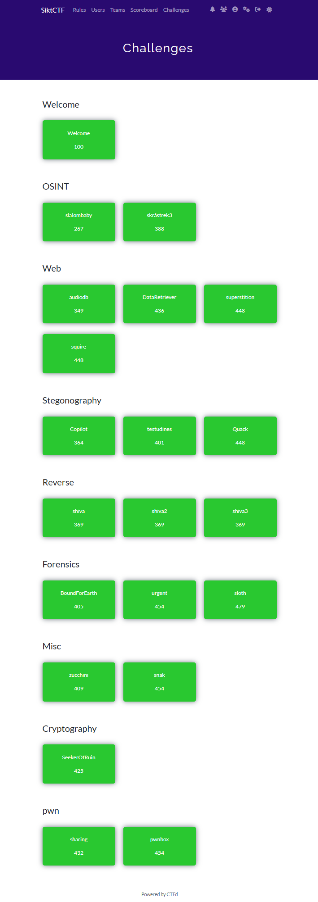

# SiktCTF-2024-writeup
My write-up for the Sikt CTF 2024.

## Welcome
- [Welcome](Welcome/welcome.md)

## OSINT
- [slalombaby](OSINT/slalombaby.md)
- [skråstrek3](OSINT/skraastrek3.md)

## Web
- [audiodb](Web/audiodb.md)
- [DataRetriever](Web/DataRetriever.md)
- [Superstition](Web/superstition.md)
- [squire](Web/squire.md)

# Steganography
- [copilot](Steganography/copilot.md)
- [testudines](Steganography/testudines.md)
- [Quack](Steganography/quack.md)

# Reverse
- [shiva](Reverse/shiva.md)

# Forensics
- [BoundForEarth](Forensics/BoundForEarth.md)
- [Urgent](Forensics/Urgent.md)
- [sloth](Forensics/sloth.md)

# Misc
- [zucchini](Misc/zucchini.md)
- [snak](Misc/snak.md)

# Cryotography
- [SeekerOfRuin](Cryptography/SeekerOfRuin.md)

# Pwn
- [sharing](Pwn/sharing.md)
- [pwnbox](Pwn/pwnbox.md)

