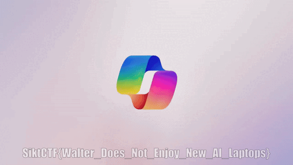

# copilot

> Oh, news from microsoft. What could this be about?
> 

## Solution
The flag is hidden in the one frame of the gif image. A hint is present in the "Comment" exif attribute. Use a tool like https://ezgif.com/split to split the gif into frames and find the frame that holds the flag..

```bash
$ exiftool Copilot.gif

ExifTool Version Number         : 12.97
File Name                       : Copilot.gif
Directory                       : .
File Size                       : 13 MB
Zone Identifier                 : Exists
File Modification Date/Time     : 2024:10:14 10:36:28+02:00
File Access Date/Time           : 2024:10:21 09:22:23+02:00
File Creation Date/Time         : 2024:10:14 10:36:26+02:00
File Permissions                : -rw-rw-rw-
File Type                       : GIF
File Type Extension             : gif
MIME Type                       : image/gif
GIF Version                     : 89a
Image Width                     : 600
Image Height                    : 339
Has Color Map                   : Yes
Color Resolution Depth          : 8
Bits Per Pixel                  : 8
Background Color                : 0
Animation Iterations            : Infinite
Comment                         : GIF edited with https://ezgif.com/add-text
Frame Count                     : 228
Duration                        : 9.12 s
Image Size                      : 600x339
Megapixels                      : 0.203

```



> Flag: SiktCTF{Walter_Does_Not_Enjoy_New_AI_Laptops}