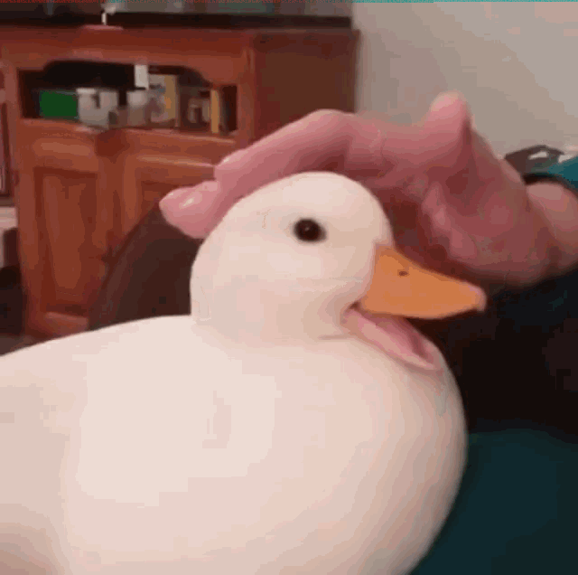

# Quack


> A duck handed me this image and said: Nak? Naknak. Naknak nak! Nananak Nak Naknak Naknak. Naknak nak. Nananak Nak Naknaknak Nak? Naknak Nak. Naknak nak? Nananak Nak Naknaknak Nananak Naknak nak? Naknak Nak? I dont get it, can you figure out what that means?



# Solution

Use https://www.cachesleuth.com/nak.html to translate naknak (duck speak) to english. 

The first duckspeak translates to "Im in the red". This is a hint that the flag is located behind the red strip in top of the image.

Use a tool like "https://onlinepngtools.com/extract-color-from-png" to extract the red layer from the image.

Upload the red image to "https://www.boxentriq.com/code-breaking/pixel-values-extractor" to find the RGB values of the pixels. 

Use vscode to strip remove the G and B values. (Replace " 0" with "").

Use https://www.prepostseo.com/tool/decimal-to-ascii to get the ASCII data from the red pixel values. You will get the following base64 encoded data:

```
TmFrPyBOYWsuIE5ha25hayBuYWs/IE5ha25hayBuYWtuYWsgTmFrbmFrIG5ha25hayBOYWtuYWsgbmFrbmFrbmFrIE5hbmFuYWsgbmFrbmFrIE5hbmFuYWsgTmFrIE5ha25hayBOYWtuYWsuIE5ha25ha25hayBOYW5hbmFuYWsgTmFuYW5hayBOYWsgTmFrbmFrbmFrIE5haz8gTmFrbmFrIE5hay4gTmFrbmFrIE5ha25hay4gTmFrbmFrbmFrIE5hbmFuYW5hayBOYW5hbmFrIE5hayBOYWtuYWtuYWsgTmFrbmFrbmFrIE5ha25hayBOYWsuIE5ha25hayBOYW5hayBOYWtuYWtuYWsgTmFrPyBOYW5hbmFrIE5hayBOYWtuYWtuYWsgTmFrbmFrLiBOYWtuYWsgbmFrbmFrbmFrIE5ha25ha25hayBuYWs/IE5hbmFuYWsgTmFrIE5ha25hayBOYW5hayBOYWtuYWtuYWsgTmFuYW5hayBOYWtuYWsgbmFrPyBOYW5hbmFrIE5hayBOYWtuYWsgbmFrbmFrIE5ha25hayBuYWtuYWtuYWsgTmFrbmFrIG5ha25ha25hayBOYWtuYWsgbmFuYWsgTmFrbmFrIE5ha25hay4gTmFrbmFrIG5hay4gTmFrbmFrIE5ha25ha25hayBOYW5hbmFrIE5hayBOYWtuYWsgTmFrbmFrIE5ha25hayBuYWtuYWtuYWsgTmFrbmFrbmFrIE5hbmFuYWsgTmFuYW5hbmFrIG5ha25ha25hayBOYW5hbmFrIE5hayBuYWs/IE5hbmFuYW5hayBOYWtuYWsgTmFrbmFrLiBOYWtuYWsgbmFuYWsgTmFrbmFrbmFrIE5haz8gTmFrPyBOYW5hbmFuYWsgbmFrPyBOYWs/IE5haz8gTmFrbmFrIE5ha25ha25hayBuYW5hayBOYWs/IE5ha25hay4gTmFrPyBuYWshIG5haz8gbmFrbmFrbmFrIE5ha25hayBuYWshIG5haz8gbmFrPyBOYWs/IG5ha25hayBuYWs/IE5haz8gTmFrbmFrIE5ha25hay4gTmFrbmFrIG5ha25hayBOYW5hbmFuYWsgTmFuYWsgTmFrPyBuYWsuIE5haz8gTmFrbmFrbmFrIG5haz8gbmFrPyBOYW5hbmFuYWsgTmFrPyBOYWtuYWsgbmFrbmFrIG5haz8gbmFrbmFrbmFrIE5haz8gbmFrISBuYWs/IE5ha25hay4gbmFrPyBuYWtuYWtuYWsgTmFrPyBuYWshIE5hbmFuYW5hayBOYWsgbmFrPyBOYWs/IE5haz8gTmFrLiBOYW5hbmFuYWsgTmFuYW5hbmFrIG5haz8gTmFuYW5hayBuYWs/IG5ha25ha25hayBuYWs/IE5haz8gTmFrPyBuYWtuYWtuYWsgTmFrbmFrbmFrIG5haz8gTmFrPyBuYWsuIE5haz8gTmFrbmFrbmFrIE5hbmFuYW5hayBOYW5hbmFuYWsgbmFrPyBuYWtuYWtuYWsgTmFrPyBOYWtuYWsuIE5hbmFuYW5hayBuYWs/IG5haz8gbmFrbmFrbmFrIE5haz8gTmFrPyBuYWs/IG5haz8gTmFrPyBOYW5hbmFuYWsgTmFuYW5hbmFrIG5haz8gTmFrbmFrbmFrIE5hayBOYW5hbmFuYWsgTmFuYW5hbmFrIE5hbmFuYW5hayBOYWs/IE5ha25hayBuYW5hayBOYWtuYWtuYWsgbmFrIQ==
```

Use https://www.base64decode.org to decode the base64 data. The decoded data is more duck speak:

```
Nak? Nak. Naknak nak? Naknak naknak Naknak naknak Naknak naknaknak Nananak naknak Nananak Nak Naknak Naknak. Naknaknak Nanananak Nananak Nak Naknaknak Nak? Naknak Nak. Naknak Naknak. Naknaknak Nanananak Nananak Nak Naknaknak Naknaknak Naknak Nak. Naknak Nanak Naknaknak Nak? Nananak Nak Naknaknak Naknak. Naknak naknaknak Naknaknak nak? Nananak Nak Naknak Nanak Naknaknak Nananak Naknak nak? Nananak Nak Naknak naknak Naknak naknaknak Naknak naknaknak Naknak nanak Naknak Naknak. Naknak nak. Naknak Naknaknak Nananak Nak Naknak Naknak Naknak naknaknak Naknaknak Nananak Nanananak naknaknak Nananak Nak nak? Nanananak Naknak Naknak. Naknak nanak Naknaknak Nak? Nak? Nanananak nak? Nak? Nak? Naknak Naknaknak nanak Nak? Naknak. Nak? nak! nak? naknaknak Naknak nak! nak? nak? Nak? naknak nak? Nak? Naknak Naknak. Naknak naknak Nanananak Nanak Nak? nak. Nak? Naknaknak nak? nak? Nanananak Nak? Naknak naknak nak? naknaknak Nak? nak! nak? Naknak. nak? naknaknak Nak? nak! Nanananak Nak nak? Nak? Nak? Nak. Nanananak Nanananak nak? Nananak nak? naknaknak nak? Nak? Nak? naknaknak Naknaknak nak? Nak? nak. Nak? Naknaknak Nanananak Nanananak nak? naknaknak Nak? Naknak. Nanananak nak? nak? naknaknak Nak? Nak? nak? nak? Nak? Nanananak Nanananak nak? Naknaknak Nak Nanananak Nanananak Nanananak Nak? Naknak nanak Naknaknak nak!
```

Decode the duckspeak to english:
```
Hello, is this what you are looking for? 
SiktCTF{IM_mULTil1NGU4l_MY_M0TH3R_TOuNG3_I5_DUC5p34k}
```

> Flag: SiktCTF{IM_mULTil1NGU4l_MY_M0TH3R_TOuNG3_I5_DUC5p34k}