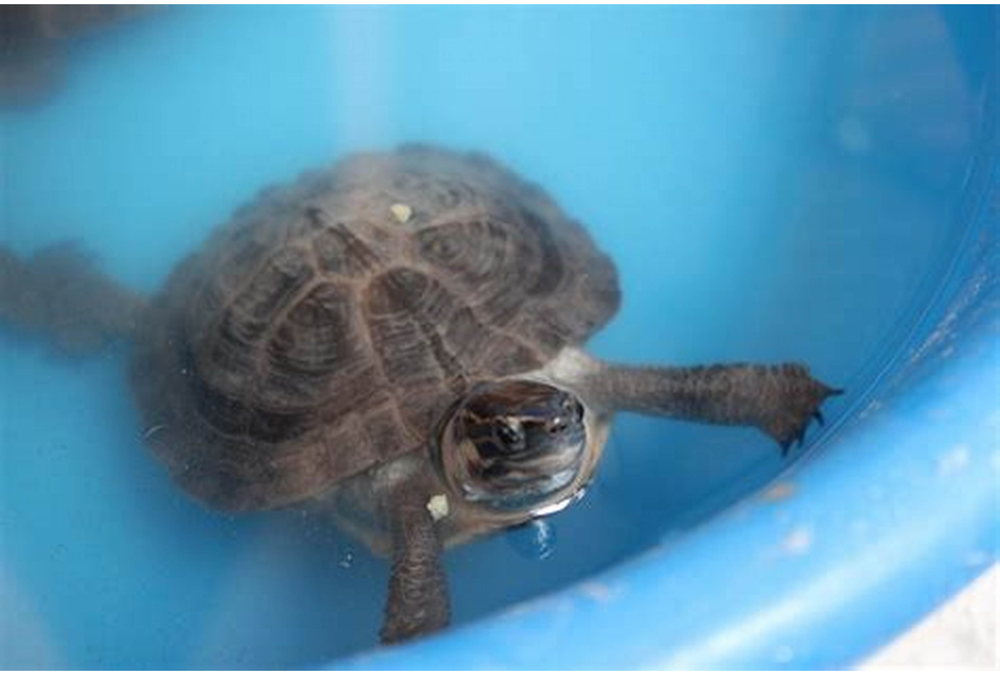
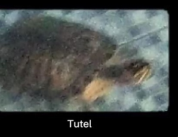
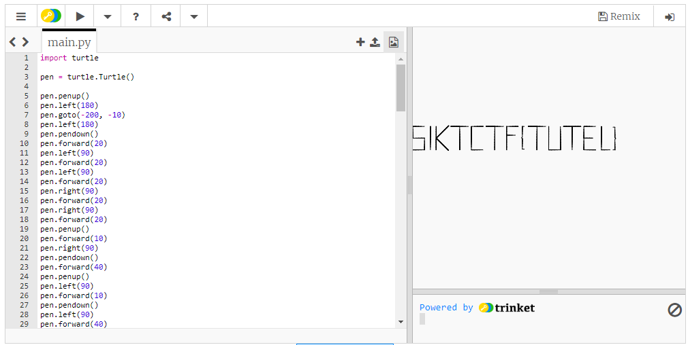

# testudines

> Look at these cute turtles (tortoises?) i found on the interwebs. 🐢🐢🐢
> 
> 

## Solution

There is penup() code in the data of the image. Use the `strings` command to extract code from the image and use a tool like https://trinket.io/python to run the code and see the flag.

```bash
$ strings turtle.jpeg
...
i)M%
e"UQR
`&)qE
1F)h
&)qKK@
penup()
left(180)
goto(-200, -10)
left(180)
...
left(90)
forward(3)
penup()
goto(180, -10)
```

```bash
$ strings tortoise.jpeg
...
>kXSs
3-53a
=hHU$
penup()
goto(12,-10)
setheading(90)
pendown()
forward(40)
..
forward(15)
penup()
goto(-230,-10)
setheading(180)
"@ | -split "`n" | ForEach-Object { "pen.$($_)" } | Set-Clipboard
```

```python
# we want to use turtle code
import turtle

pen = turtle.Turtle()

pen.penup()
pen.left(180)
pen.goto(-200, -10)
pen.left(180)
pen.pendown()
pen.forward(20)
pen.left(90)
pen.forward(20)
pen.left(90)
pen.forward(20)
pen.right(90)
pen.forward(20)
pen.right(90)
pen.forward(20)
pen.penup()
pen.forward(10)
pen.right(90)
pen.pendown()
pen.forward(40)
pen.penup()
pen.left(90)
pen.forward(10)
pen.pendown()
pen.left(90)
pen.forward(40)
pen.backward(20)
pen.right(45)
pen.forward(30)
pen.backward(30)
pen.right(90)
pen.forward(30)
pen.backward(30)
pen.right(45)
pen.forward(20)
pen.penup()
pen.left(90)
pen.forward(40)
pen.left(90)
pen.pendown()
pen.forward(40)
pen.left(90)
pen.forward(15)
pen.backward(30)
pen.penup()
pen.backward(25)
pen.pendown()
pen.forward(20)
pen.left(90)
pen.forward(40)
pen.left(90)
pen.forward(20)
pen.penup()
pen.forward(20)
pen.left(90)
pen.pendown()
pen.forward(40)
pen.left(90)
pen.forward(15)
pen.backward(30)
pen.penup()
pen.backward(25)
pen.pendown()
pen.forward(20)
pen.left(90)
pen.forward(40)
pen.backward(25)
pen.left(90)
pen.forward(15)
pen.penup()
pen.left(90)
pen.forward(15)
pen.right(90)
pen.forward(15)
pen.pendown()
pen.backward(3)
pen.right(90)
pen.forward(18)
pen.right(45)
pen.forward(2)
pen.left(90)
pen.forward(2)
pen.right(45)
pen.forward(18)
pen.left(90)
pen.forward(3)
pen.penup()
pen.goto(142, -10)
pen.setheading(0)
pen.pendown()
pen.forward(3)
pen.left(90)
pen.forward(18)
pen.right(45)
pen.forward(2)
pen.left(90)
pen.forward(2)
pen.right(45)
pen.forward(18)
pen.left(90)
pen.forward(3)
pen.penup()
pen.goto(180, -10)
pen.penup()
pen.goto(12,-10)
pen.setheading(90)
pen.pendown()
pen.forward(40)
pen.left(90)
pen.forward(15)
pen.backward(30)
pen.penup()
pen.backward(5)
pen.left(90)
pen.pendown()
pen.forward(40)
pen.left(90)
pen.forward(20)
pen.left(90)
pen.forward(40)
pen.penup()
pen.right(90)
pen.forward(5)
pen.pendown()
pen.forward(30)
pen.backward(15)
pen.right(90)
pen.forward(40)
pen.penup()
pen.left(90)
pen.forward(40)
pen.pendown()
pen.backward(20)
pen.left(90)
pen.forward(20)
pen.right(90)
pen.forward(15)
pen.backward(15)
pen.left(90)
pen.forward(20)
pen.right(90)
pen.forward(20)
pen.penup()
pen.forward(10)
pen.right(90)
pen.pendown()
pen.forward(40)
pen.left(90)
pen.forward(15)
pen.penup()
pen.goto(-230,-10)
pen.setheading(180)
```



> Flag: SiktCTF{tutel}