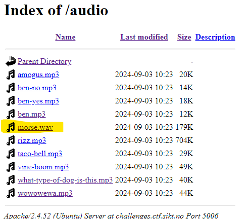
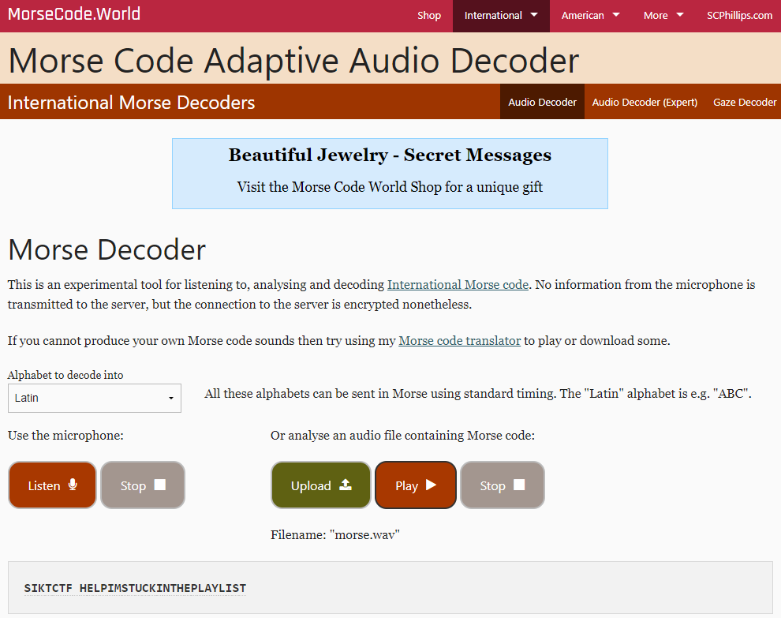

# audiodb

> My little brother made a new audio database and player site. Hope its secure...
> http://challenges.ctf.sikt.no:5006

## Solution
The html code shows that the sound files are stored in http://challenges.ctf.sikt.no:5006/audio/. If you browse to this location in your browser you will see all files in the directory. 

There is a file called `morse.vaw`. Download the file and upload it to a morse to text tool like https://morsecode.world/international/decoder/audio-decoder-adaptive.html to get the flag in text format.

> Flag: SIKTCTF{HELPIMSTUCKINTHEPLAYLIST}