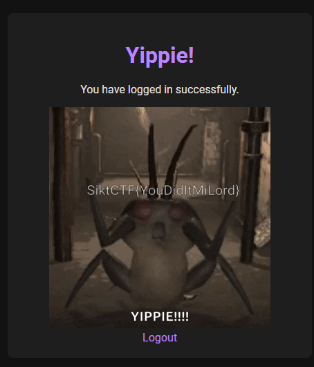

# squire
> Your squire walks up to you, trembling visibly. "Milord, the fortress walls are impenetrable! No warrior has breached its gates or gazed upon its inner sanctum for a thousand years. You must reconsider this perilous endeavor." His hands clumsily clutch the flagpole as he speaks, betraying his fear. Yet, he knows nothing of your secret plans. There's no way he could. "The battlements are manned by the elite of the elite, led by a figure they call 'The First,'" the squire continues with a quiver in his voice. "The gates are reinforced with the strongest iron. Our siege engines are but toys against their defenses. Pray, milord, heed my words and spare our men from certain doom." You look out over the battlefield, the weight of leadership heavy on your shoulders. Indeed, 'The First,' the one who commands the fortress, has ruled for centuries—perhaps not a king, but a ruler nonetheless. Yet the squire knows little of the intricate web you’ve woven. For there are those on the inside—key figures in the structure—ready to open the gates when the time is right. You nod thoughtfully at the squire, masking your true intentions with a facade of contemplation. "Your loyalty and concern do you credit," you say, "but fear not. I have taken measures that go beyond mere force. Our victory lies not just in strength, but in understanding who holds the key. Ready the men and trust in my command." The squire bows, still anxious but somewhat reassured by your words, and retreats to carry out your orders. As he departs, you cast your gaze back to the fortress, confident that the doors will open, not through brute force, but by aligning with the one at the top—the one who has always had access, from the very beginning..
> 
> http://challenges.ctf.sikt.no:5003

## Solution

A SQL injection vulnerability is present on the login page.

Use the following injection to bypass the login check:
```
Username: admin
Password: ' OR '1'='1
```


> Flag: SiktCTF{YouDidItMiLord}